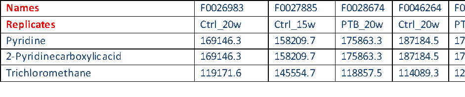

MassOmics
================

An R package of untargeted metabolomics Batch processing using the NIST Mass Spectral Library
 
Author: Guangyu GUO, Elizabeth J. McKenzie, M. Beatrix Jones, Megan Friesen, Erica Zarate, Stephanie Andraos, Ting-Li Han

* [Abstract:](#Abstract)
* [Package installation](#package-installation)
* [Preprocessing](#preprocessing)
   * [Accessing the software](#accessing-the-software)
      * [Access the package from a windows desktop](#access-the-package-from-a-windows-desktop)
      * [Access the package from R console](#access-the-package-from-r-console)
      * [Access the package, ChemStation and AMDIS software from a remote computer](#access-the-package-chemstation-and-amdis-software-from-a-remote-computer)
   * [Agilent Chemstation: create subset NIST library](#agilent-chemstation-create-subset-nist-library)
   * [R console: merge the identification output to make a library](#r-console-merge-the-identification-output-to-make-a-library)
   * [Lib2 NIST converter: convert library to AMDIS compatible format](#lib2-nist-converter-convert-library-to-amdis-compatible-format)
   * [AMDIS: Convert and merge libraries](#amdis-convert-and-merge-libraries)
   * [AMDIS: optimise deconvolution and identification settings](#amdis-optimise-deconvolution-and-identification-settings)
   * [AMDIS: deconvolute and identify](#amdis-deconvolute-and-identify)
   * [R-console: Produce summary report](#r-console-produce-summary-report)
   * [R-console: Curation of summary report](#r-console-curation-of-summary-report)
* [Batch integration](#batch-integration)
   * [R-console: Integrate peaks](#r-console-integrate-peaks)
   * [R-Console: Laboratory contaminant removal](#r-console-laboratory-contaminant-removal)
   * [Excel: Manual filtering](#excel-manual-filtering)
   * [Updating the Summary Report](#updating-the-summary-report)
   * [R console: Normalisation](#r-console-normalisation)
   * [R console: Batch correction normalisation using sample median](#r-console-batch-correction-normalisation-using-sample-median)
   * [R console: Batch correction normalisation using SERRF](#r-console-batch-correction-normalisation-using-serrf)
   * [Reproducibility](#reproducibility)
* [Pathway analysis:](#pathway-analysis)
   * [Data formatting and molecule name mapping](#data-formatting-and-molecule-name-mapping)
   * [Run pathway analysis](#run-pathway-analysis)
* [Miscellaneous](#miscellaneous)
   * [Example data](#example-data)
   * [For Mac OS users](#for-mac-os-users)
   * [For Linux OS users](#for-linux-os-users)
   * [Example of KNIME workflow](#example-of-knime-workflow)
   * [Session information](#session-information)
   * [References](#references)
   
[](https://zenodo.org/badge/latestdoi/193418922)

# Abstract:

Large-scale gas chromatography-mass spectrometry (GC-MS) based
untargeted metabolomics, where hundreds or thousands of samples are
analysed over a period of weeks or months, has specific challenges.
These include variation in instrument performance, signal intensity loss
due to column ageing, the build-up of contaminants in the ion source,
and sample handling variability. In addition, the computational
challenges of compound identification are intensified when dealing with
a large number of samples. A data processing software package to address
these problems is required. Our software, MassOmics, is designed to
bring together R packages and scripts for GC-MS data processing to
rapidly integrate and annotate peaks in large-scale datasets, all within
a graphical user interface. This package also provides identification of
background contaminants, data scaling and transformation, various batch
effect removal methods, machine learning-powered grouping of
metabolites, and metabolite importance analysis. With these functions,
MassOmics can parse and summarize library batch search results from
ChemStation and MassHunter, and produce an output, which is compatible
with various downstream statistical and metabolic pathway analysis
tools. The module-based design and intermediate data transferring
approach enable MassOmics to work with data integration platforms such
as KNIME to generate an adaptive and customizable processing workflow.
The MassOmics package is designed for researchers with little experience
using R, and substantially improves GC-MS data extraction efficiency and
accuracy, as well as reducing the time required for manual checking and
re-integration.

In 2013, there was no method for extracting all peaks in a chromatogram
and simultaneously identifying peaks. Elizabeth developed this method in
2013 by building a subset mass spectral library from the full NIST
library using ChemStation so that AMDIS could be used for deconvolution
and identification of large batches (\>100) of samples. The library
subset scripts were produced by vicky fan in 2014. Morgan Han
implemented the scripts into his 'MassOmics' R package in 2015.

In addition, data was not being processed to remove lab contaminants and
analytical bias so Elizabeth began implementing a series of data quality
checks based on negative controls, pooled sample quality controls and
analytical standards.

In 2015, Elizabeth worked with Beatrix jones to develop normalisation
methods that could be implemented into the data processing pipeline for
removing technical batch effects. Morgan Han implemented basic
normalisation scripts into his MassOmics R package in 2016. In 2016,
Elizabeth worked with the centre for electronic research to set up a
virtual machine with all of the software required for GC-MS data
processing.

Phd student Megan Friesen produced the first draft of these instructions
when Elizabeth first tested the method with her samples in 2013.
Elizabeth revised them in 2014, Erica Zarate added some additional
material in 2015, and Elizabeth updated and expanded them in 2016.
Stephanie Andraos added images and clarifications in 2017.

In 2018, George Guangyu GUO became the maintainer of this package. He
has added machine learning-powered batch effect removal functions,
refined the processing pipeline and R package build.

# Package installation

This is an tutorial for use of MassOmics. To access the software use the
installation codes as below:

``` r
#install the git package
install.packages("devtools")
Sys.setenv(R_REMOTES_NO_ERRORS_FROM_WARNINGS=T)
library(devtools)
install_github("MASHUOA/MassOmics",force=T)
3
no
#Update all dependencies
BiocManager::install(ask = F)
yes
library(MassOmics)
Creat_short_cut()
```

# Preprocessing

This section involves extracting and pre-processing the data to produce
a data template of retention time bins and compound identifications for
batch integration. As part of this process, a subset mass spectral
library will be constructed from the NIST/Wiley library. The purpose of
the subset library is to enable the AMDIS software, which has a
limitation on library size, to deconvolute and identify features.

## Accessing the software

### Access the package from a windows desktop

If you run the following code in a windows OS, you will find a MassOmics
shortcut on the desktop. Double click the shortcut, and the MassOmics
package will run without any further input.

``` r
library(MassOmics)
Creat_short_cut()
```

### Access the package from R console

If you are using other OS (e.g. Mac or Linux), you can initiate the
R.GUI console and input the following codes. More instructions can be
found in the misc section.

``` r
library(MassOmics)
MassOmics.GUI()
```

### Access the package, ChemStation and AMDIS software from a remote computer

1\) Click the Start button

2\) Type: Remote Desktop Connection

3\) Map:
[\\\\uoa.auckland.ac.nz\\shared\\MED\\LIGI\\LigginsMetabolomics](file:///\\uoa.auckland.ac.nz\shared\MED\LIGI\LigginsMetabolomics)

    **WARNING:**

    When logging out of the virtual machine:

    DO NOT PRESS THE ***SHUTDOWN*** BUTTON (screenshot 1) as this will
    completely turn off the virtual machine and will restrict everyone’s
    access to it. Instead, go to your profile icon and press ***SIGN
    OUT*** (screenshot 2).

    

## Agilent Chemstation: create subset NIST library

1.  If you don't have native Agilent .D format datafiles, you will need
    to convert your .raw or .qgd files to CDF (NASA Common Data Format)
    and Agilent .D format. Open Chemstation and convert the CDF's using:
    File-export AIA datafiles. \*\*Can AMDIS or MSConvertGUI be used? If
    so, give instructions.

2.  If you started with Agilent format files you will still need to use
    Proteowizard or Chemstation to convert them to CDF so that they can
    be processed later using R.

3.  For large batches with pooled QC samples that are representative of
    all samples, open a quality control sample from the middle of the
    sequence. If your samples are quite different from one another, or
    you are looking for subtle metabolic markers, open your first
    sample.

4.  For this method, it is best not to do background subtraction because
    of potential data loss. The background will be filtered out at a
    later step.

5.  Integration

    1.  Choose 'chromatogram', then 'integrate'. Zoom in and see if it
        is integrating all the peaks. It is better to be over-sensitive
        (detecting too many peaks) than under-sensitive.

    2.  If it needs adjusting, go to MS Signal Integration Parameters.

    3.  Select Initial threshold, enter a number in the value box and
        click enter and "apply".

    4.  Play with the setting until it integrates all of the peaks
        satisfactorily.

6.  Choose Spectrum-\>Select library-\>select the latest NIST/Wiley main
    library. Do not use the NISTEPA or other subsets of the main NIST
    library as these only have a few compounds.

7.  If you have quality control (QC) samples that are representative of
    your whole sample set, use the first, middle and last QC to
    construct your subset library. If you do not have QC's you will need
    to do this step for every sample. If you have QC's but your samples
    are radically different because of strong intervention effects, then
    you should use three samples from each intervention group, as well
    as three QC's. If all of your samples are radically different you
    should do every single one.

8.  You should also do this for standards, but you do not need to do
    this for blanks.

9.  The Agilent Chemstation identification algorithm is less than ideal,
    so we use all 10 of the hits returned for each peak to build a
    subset library for AMDIS.

10. Spectrum -\> Edit Strategy

| U + A: 2                        |
|---------------------------------|
| Flag threshold: 3               |
| Min Est purity: **50**          |
| **Allow** duplicate CAS         |
| **No** Cross-correlation sort   |
| **Yes** Tilting                 |
| Low MW= your lower scan limit   |
| High MW = your upper scan limit |
| Max hits 10                     |

*Note: The **Help** button in the pop-up window details the function of
each parameter.*

1.  For Agilent data, your scan limits are in the acq.txt file, which is
    in each of your .D data files. For other vendors, you will need to
    find what mass scan range you used (hopefully you already knew this
    beforehand from method optimisation).

2.  Method \> Save Method as (make a name for your method)

3.  Load the first chromatogram to integrate.

4.  Chromatogram- Integrate

5.  Export Reports – Library Search to XLS (be sure you have already
    updated to NIST library in the Spectrum – select library)

    1.  If there are a couple of error messages just click 'OK', and
        minimise Excel.

    2.  Open the folder containing the .D sample file. Open the .D file.
        It should contain a file called 'msrep.xls'.

    3.  Open the msrep.xls file, enable editing. Nothing will appear on
        the first worksheet. Open the second tab in the worksheet (Lib
        Res).

    4.  Important: wait until the results have finished generating. This
        may take some time. Make sure the chromatogram appears on the
        bottom of the spreadsheet before saving.

    5.  When it has completed, click on the 'Hit Number' field. Choose
        'data' – 'filter'. When you click on 'Hit Number' to sort it,
        check to see if you have a checkbox that says 'blank'. If you do
        not, then close the file. If you do, uncheck all the boxes
        except 'blank' and delete the row(s) with the missing values.

        

6.  Save the xls file in a folder called 'xls files' with the same name
    as the sample.

7.  Repeat for each datafile. Make sure they are all saved together in
    one folder.

8.  Close Chemstation. (Important to do this, if you are using AMDIS
    with .D files.)

9.  Another option for automatic library search report exportation is to
    use the command under "Export Reports" tab: "Library search report
    for selected folder". this function will automatically export every
    raw data file within the selected folder. And a csv file will
    generated under each .D directory. In later step in massomics
    pipeline, the software will use these csv files directly to generate
    the sub library.


## R console: merge the identification output to make a library

1.  Ensure that you have one folder with all of the data files you want
    to analyse in CDF ('common data format') format.

2.  Open MassOmics

3.  Choose – Software -create a sub-NIST library.

4.  Go to Step 1 - Setup working directory - select the folder
    containing the Agilent, CDF and xls folder, but not the xls folder
    itself.

5.  Then - Generate entry – Run - select xls file

6.  Wait until it completes. Two files are generated: 'Merged' = all
    data merged, and 'Unique entry no' = the NIST ID number of all
    compounds, sorted, with duplicates removed.

7.  At this stage, if there are any mass spectra you want to add
    manually, using NIST entry ID numbers, you can just add them to the
    Unique entry list. Just double-check they are not already there.

8.  The simplified process could be achieved via the batch library
    export mode: after step. 19, you can press the "Generate entry" and
    select the Agilent data file folder. The function will search all
    Agilent data in this folder for any library pre-search result files.

    

## Lib2 NIST converter: convert library to AMDIS compatible format

1.  Open the Lib2Nist converter (free – download from AMDIS website)

2.  Select the full NIST library (eg: c:database/NIST14.L)

3.  Check that the NIST library filepath is correct. Change it if it
    isn't.

4.  Change the "output" (file path) to your working folder.

5.  Select 'Define subset'.

    1.  Check that subset type is 'ID numbers'.

    2.  Check Subset source is 'from file'. Select Browse- and navigate
        to your unique entry no.txt file and select 'Open'. Press OK.

    3.  Click on the input libraries or text file to highlight it.

    4.  Check that the output format is in MSP

    5.  Click on 'Convert'

    6.  A file should appear in your working folder called NISTXX.msp.

6.  The simplified process of this section could be achieved via the
    built-in function of MassOmics In STEP 2 Make an MS library. You can
    specify the Lib2Nist installation path then press the generate MSP
    library button and finally choose the "unique entry no.txt". The
    function will find the Lib2Nist.exe and perform the MSP sub-library
    exportation automatically.

    

## AMDIS: Convert and merge libraries

*If you are doing SPME or TMS data analysis, do not merge both NIST and
in-house libraries.  
If you are doing MCF data analysis, you will need to merge the in-house
library with the NIST.*

1.  Open AMDIS and load one of the QC's or a representative sample, or
    your first sample. Go to analyse settings and **make sure the
    library selected is not one you are seeking to merge. If it is, then
    AMDIS will crash.**

2.  Select Library - Library transfer.

3.  Files (Destination) load the \*.msl library on the **right-hand
    side** if you are merging it with the NIST MSP library. Save it with
    a different name. Otherwise leave it empty. **NOTE:** **If you swap
    the left and right side you will generate "NA" in your summary
    report.**

4.  Files - (Source) Load your NIST.msp Library.

5.  Files (Source) :

    1.  If you are only using the NIST library: Click the 'Create New
        Library' - and give it a meaningful name e.g.:
        'petrel_NIST05_subset.msl'. Click 'OK'. An empty .msl file will
        be created in your folder.

    2.  If you are merging both NIST and in-house libraries: Click the
        'Save Library As', otherwise the compounds on the left hand-side
        will disappear.

6.  Select all of the compounds on the left hand side and click
    "Transfer". It may take some time until the compounds appear in the
    right hand side. Verify that the number of compounds increases after
    merging both libraries.

7.  When it has completed, select 'Exit'. Now the .msl file in your
    folder will contain data. If it crashes, do not panic. Simply wait a
    bit then close the popup window and AMDIS. Open the files and check
    the numbers of compounds – you will find they usually successfully
    transfer.

8.  Open the final file and make sure that it actually is a .msl file
    (contains brackets) vs .msp (a list of numbers):

    

9.  The simplified process of this section could be achieved via the
    built-in function of MassOmics In STEP 2 Make an MS library. You can
    tick the Convert MSP to MSL library to let the function
    automatically convert the exported MSP sublibrary to MSL library. In
    another way you can press the MSP-\>MSL button and choose an
    existing MSP file to convert it into MSL format.

    

## AMDIS: optimise deconvolution and identification settings

1.  Select Analyse \> Settings

    1.  If you are using an in-house library with retention times, then
        use: Retention time or Retention window (0.5 to 3 min depending
        on your sample size: see explanation below)

    2.  If you are using the NIST library, use simple.

    3.  If you have merged both NIST and in house libraries, use
        retention time.

        *Explanation*

        *Retention times explained:*

        Retention time represents the sample to sample + sample to
        library discrepancies.

        Sample to sample differences: the same compound might be picked
        up at different retention times within one experiment: i.e.
        between your first, second. N sample.

Sample to library differences: Retention times in the library are
different to the ones in your generated dataset.

The bigger your sample size, the bigger you should set your retention
time (as there will be higher variability compared to an lower sample
size). Use Chemstation to plot the D4-alanine (your internal standard)
from the first and the last samples run to roughly estimate the level of
variation.

*Reason for NIST not having retention times:*

The NIST library is an international library of compounds. Since the
full NIST library is collated from experiments in different laboratories
/ different columns to detect specific compound of interest, retention
times are not included in the NIST contrarily to the in-house library
created at the School of Biological Sciences.

Match factor penalties:

Penalties for finding differences between the NIST and the generated
dataset. If the penalty is too high, matching factors will be falsely
decreased.


1.  Under the Instrument tab:

<!-- end list -->

1\) Insert the lowest and highest m/z. (If you can't remember it is in
the acq.txt file inside your .D files.) Do not use auto as it may slow
processing.

2\) Uncheck scan sets.

3\) Data file format: use native Agilent files or CDF for non-Agilent
machines. Scan direction will adjust automatically after you select
this.

4\) Instrument type=quadrupole

5\) Threshold=off (Adjust this to low, med or high if you get excessive
component detection due to noise.)

<!-- end list -->

1.  Under the Deconvolution tab:

<!-- end list -->

1\) Component width = 12 (default)

2\) Adjacent peak subtraction = two. If it proves to be too slow use
'one'

3\) Resolution = medium

4\) Sensitivity = medium. If it proves to be too slow use 'low'.

5\) Shape = low

<!-- end list -->

1.  Under the Library tab – Select New - your new NISTXX_subset.msl and
    select 'open'. If AMDIS crashes, then try it again but make sure you
    click 'no' when it asks to build a CID file.

<!-- end list -->

1\) Under QA/QC:

    1.  For SPME: uncheck Solvent tailing

    2.  For MCF, choose 83 (main ion for chloroform)

    3.  For TMS choose 79 (pyridine)

*If you are uncertain check the mass spectrum of your chromatogram at
the very beginning and very end.*

2\) For column bleed choose 207 if you are using a 1701 or 5ms column.

<!-- end list -->

1.  We do not use the scan sets or filter tabs. Check that these are
    disabled.

2.  Click save and run.

3.  The top line shows () which means that a compound is a present at
    this level and (**T**) which means that it has been identified.

4.  Zoom in on all sections of the chromatogram to see if any peaks ()
    are not flagged as targets (**T**). Adjust the match factor and
    other parameters to maximise peak targeting.

5.  When you are happy that your settings are detecting all the peaks,
    go to Analyze, Settings, and save as onsite.ini in your folder.

## AMDIS: deconvolute and identify

1.  File- batch job- create and run job

2.  Remove any data files from someone else's analysis.

3.  Add all of your files.

4.  Add INI settings: navigate to your folder: onsite.ini – Set

5.  Analysis type- Simple

6.  Check Generate report- include only first 1 hits

7.  Save as- AMDIS_NIST_batchreport.job- save

8.  Run (will take several hours, depending on your data).

9.  Close AMDIS when finished. Open the txt file generated and check it
    contains data.

## R-console: Produce summary report

1.  Open R and load the MassOmics package as previously described.

2.  Go to Software – GCMS data processing

3.  Under 'Setup':

<!-- end list -->

1\) Select your working folder

2\) Tick 'Autoselect Reference Ions'

3\) Leave Detect multiple peaks and Ret time filter at the default
values (60 sec and 2.5 min, respectively) to begin with.

4\) Create identification/summary report – Run.

5\) Select your subset msl library and then the AMDIS_batch.txt file

<!-- end list -->

1.  If no report is generated, have a look at the error message. The
    following compound names will cause .png name errors when running
    the Summary Identification Report:

    1.  Names longer than 129 characters, eg:
        1H-Cyclopenta(1,3)cyclopropa(1,2)benzene,
        octahydro-7-methyl-3-methylene-4-(1-methylethyl)‑,(3aS‑(3a.alpha.,3b.beta.,
        4.beta.,7.alpha.,7aS\*))-

        **Solution:** Zoom out to \<20% and look for compound
        names \>129 characters. Look up the CAS number for the compound
        in SciFinder. Substitute with the common name of the compound

    2.  Names with ' in front, eg: 'Tricyclo(5.4.0.0\<2,8\>)undec-9-ene,
        2,6,6,9-tetramethyl-, (1R,2S,7R,8R)-

        **Solution:** It is a Microsoft excel formatting problem which
        is complicated to fix. See Google.

2.  If successful, three items will be produced: a summary report, a
    graphical plot of the retention time and a folder of ret shift
    warnings.

3.  You can save a pdf of the graphical plot with your data.

4.  If you are running more than one data set at this point, make sure
    you change the file name for the retention shift warnings otherwise
    it will overwrite.

## R-console: Curation of summary report

1.  Create a copy of the summary report generated as a reference file.

2.  Open the Summary report and sort by Total ID and delete all that are
    \< 10% of your dataset or a value that you determine based on your
    hypothesis (for example, half of the smallest possible confounding
    group).

3.  Sort largest to smallest by ret time shift (stdev) upper and colour
    code all \> 30sec. Do the same for ret time stdev lower. Save the
    file as .xls

4.  Sort by name (A-Z) and check through the 'split' peaks, using the
    image files in the ret_60sec folder generated with the summary
    report to determine which peaks are real or not. Most of the
    compounds with large ret shifts will be removed using this
    approach*.*

5.  When assessing the retention time distribution plot:

    1.  A " " symbol : means that the same compound has been identified
        with the same retention time within different samples: which is
        what you would expect to see

    2.  A " " symbol : means that the same compound has been identified
        with different retention times in different samples : Not a very
        good sign

        ***NOTE**: pay attention to the scale on the images. Sometimes
        the scale is exaggerated, which means that points that appear to
        be far apart are in fact close together.*

6.  Sort by Ref Ion, look up each compound on Agilent ChemStation and
    input a larger ion for all compounds giving an ion equal to or less
    than the minimum scan mass. To do this go to 'view' – parametric
    retrieval – then input the CAS number, and search. Choose the most
    intense ref ion that is \> than your lowest scan value. For each
    subsequent search use – retrieve – set parameters

# Batch integration

## R-console: Integrate peaks

1.  Make sure all CDF files are in one folder and all elu/fin/other
    files are not in that folder.

2.  Open R and load the MassOmics package "library(MassOmics)"
    \<enter\>"run()" \<enter\>.

3.  Go to Software – GCMS

4.  Step 2: Select "fast mode".

5.  Select peak area.

6.  Leave ion mass bin at 0.5

7.  Select 'Run'

8.  You will be prompted to select the Identification/Summary
    Report.csv, and then the folder containing the cdf files.

9.  Integration will take a long time (2-3h).

10. A file will be created called something like GCMS Results.csv.

11. For rows that are completely "zero" and check that the reference ion
    falls within your mass scan range. Insert an appropriate reference
    ion using the instructions above.

## R-Console: Laboratory contaminant removal

1.  Run the contaminants script. To do this, open MassOmics and choose
    software – data cleanup and normalisation. Make a subject info sheet
    (see image at left). Assign analytical or daily batches to match the
    order the samples were analysed in.


1.  The default settings of 60% and two fold are quite good for most
    datasets. You can adjust them, depending on your type of data.

2.  Once a csv file is generated, save it as an xls before you continue.

3.  Using Excel, sort all blanks and QC's and samples so that you can
    easily compare blanks with samples and QC's when graphed.

4.  You can remove all compounds that fail both tests.

5.  The contamination script is not perfect. If you wish to remove more
    compounds, sort by 'percent above'. Generally, you can remove
    compounds \<44% above. Then sort by 'ratio above'. Generally, those
    \<1.3 can be removed. You may wish to check these manually as well.

6.  To check compounds manually, you can use the 'plot' option in the
    data cleanup menu.

7.  It is important to keep a record of each step at the top of your
    Excel file, as will make it easier for you to work backwards if you
    need to later on.

## Excel: Manual filtering

1.  Sort by retention time.

2.  Look down the ref ion column. Look for duplicate adjacent ions, then
    look at intensities, for duplicates.

3.  Highlight duplicate intensities with the same ref ion. These may not
    always be right next to each other.

4.  Once you have done this for the entire dataset, sort by the sample
    with the most abundant intensity. Check for any duplicate
    intensities that you may have missed. You can use conditional
    formatting to find duplicate values, but it has a tendency to crash.

5.  Insert a column to the right of retention time. Subtract the higher
    ret time from the lower one so that you have values representing the
    distance between each retention time.

6.  Highlight the retention times that are \<0.10 away from the
    preceding retention time.

7.  Copy and paste the spreadsheet with all the highlights into a new
    worksheet.

8.  Remove duplicate peaks based on (in order of importance)

    1.  number of ID (should be high)

    2.  retention shift (should be low)

    3.  match factor (should be high).

9.  For peaks that are very close in retention time (but may have
    different ions), find the sample with the highest abundance by
    plotting the intensity for all samples in Excel.

10. Then open the sample and plot the ref ions for the compounds that
    are close in retention time. Look at the overlaid chromatogram to
    determine how many peaks there are and which ions are contributing
    to the peak.

11. Look up the CAS numbers for these coeluting peaks and examine the
    mass spectra. They may have ions in common.

12. Once you have determined the number of peaks and compounds you can
    remove the duplicates based on the criteria above.

13. Sort by ref ion and use Chemstation (View-Parametric Retrieval) to
    look up and input larger ref ions for those equal to or less than 45
    if possible (obviously not if you are doing volatiles).

## Updating the Summary Report

1.  Go back to the Summary report, make a new copy
    "Summary_report_final" and remove and update all compounds/ions that
    you have changed on the datasheet.

2.  Tidy up names, correcting or removing peak numbers where
    appropriate.

3.  Annotate names for compounds with match factors \<60% as "unknown",
    those from 60-75% with "tentative", those 75-100 with "putative",
    and those with reference standard retention time and mass spectral
    matches with "identified".

4.  Add in CAS numbers for those with only NIST numbers (prefixed by
    1000xxxxxxx)

5.  Rerun the peak integration with peak area.

6.  Choose Slow mode (unclick Fast Mode)

7.  An overlaid chromatogram graphic will be generated. Maximise the
    graphic. Save it as a pdf then open it and examine the overlays for
    each compound.

8.  If there are some peaks with incorrect ret windows, adjust the upper
    and lower ret shift on the Summary Report and then re-run the
    integration until you are satisfied with the report.

9.  To do this, calculate the difference between
    the corrected start to the ret bin and the median ret time, and the
    difference between the corrected finish to the ret bin and the
    median ret time. Because the time units are in thousandths they need
    to be converted to seconds by multiplying by 1000 then dividing
    by 60. So the formula should be: =(median ret-start ret
    bin)\*1000/60, or =(end ret bin-median ret time)\*1000/60

## R console: Normalisation

1.  Insert a row with injection order and sort the samples by injection
    order.

2.  Liz detailed explanation

3.  Plot the first compound using Excel. If you have used liquid
    injections you will notice that the data is 'clumpy' and has a
    strong analytical batch effect. SPME data is less affected by
    technical effects and may only need very minimal normalisation.

4.  Normalise the data by internal standard, if you have used one, or
    more if you have used more. Save the file. Check that all internal
    standards have improved the QC sample reproducibility. If not,
    normalise only by sample median.

5.  NOTE: The Sample info sheet batch column \*must\* be running,
    continuous whole numbers, starting at 1.

6.  Plot the data again. For liquid injections, you will see there is
    still a residual batch effect.

## R console: Batch correction normalisation using sample median

1.  Open up the sample info file and assign an analytical batch number
    (based on the injection order and the size of each analytical batch)
    to every sample/blank/QC.

2.  Normalise by sample median. (Note: QC median does not adequately
    normalise the samples.)

3.  Check that normalisation has worked by plotting each compound in an
    excel graph.

4.  If there is still a batch effect, consult a statistician.

## R console: Batch correction normalisation using SERRF

1.  SERRF will generate batchly segmented time-series (injection order)
    response profile of for each identified molecules in the project,
    and classify them into different cluster. The time-response model
    will be built for each cluster, and the baseline response of each
    time point (injection) will be predicted based on each batch
    prediction model.

2.  Open up the sample info file and assign an analytical batch number
    (based on the injection order and the size of each analytical batch)
    to every sample/blank/QC.

    

3.  Normalise using SERRF. (Note: To adequately normalise the samples by
    QC, 5 or more QC samples in every batch is recommended.) Normalized
    by sample is also available, be sure that there is balanced
    population between control case sample and treatment case sample in
    every batch. Otherwise, the normalization will produce a biased or
    overfitted result.

4.  Press the MassOmics button to perform SERRF normalization using
    MassOmics pipeline integration result. Or use the MSDIAL button to
    do the SERRF normalization on a MSDIAL exported file.

    

5.  Check that normalisation has worked by review the quality control
    plots in the SERRF subfolder.

    

## Reproducibility

1.  If you have used pooled Quality Control samples, you may wish to
    remove all compounds with a QC reproducibility \<30%.

# Pathway analysis:

## Data formatting and molecule name mapping

1.  Choose "Format MassOmics data for pathway analysis" tab. This
    function will return a pathway analysis formatted file for you. The
    function will need you to point out two files' location: File1
    integration result file, file2 sample info file.

    

2.  Choose the "Replace name by KeggCodes" tab, and you will find the
    names have been converted into KEGG codes.

    

## Run pathway analysis

1.  Choose the "Run pathway analysis" to have a PAPi package powered
    pathway analysis. The returned result contains a table of Pathway
    response for each input data and a plot that shows every identified
    pathway response.

    


**Pathway analysis curation and refinement**

1.  You could modify the entries in the file from "Format MassOmics data
    for pathway analysis" by using some other name from KEGG library and
    do the "Run pathway analysis" again. The SimScore shows a string
    similarity between the observed molecule and mapped identities in
    KEGG library.


# Miscellaneous

## Example data

The MassOmics comes with a example dataset, which is a large scale
untargeted metabolomics experiment including 400 GC-MS runs. In the data
folder you will find a table of the sample information. You can download
these raw data set into a local folder.

``` r
#install.packages("piggyback")
library(piggyback)
library(MassOmics)
Sys.setenv(GITHUB_TOKEN="a124a067ed1c84f8fd577c972845573922f1bb0f")
#made sure that this foler has enough space
wd=paste0(file.path(path.package(package="MassOmics")),"/data/")
setwd(wd)
pb_download("Data.tar.gz", repo = "MASHUOA/MassOmics", dest = ".")
untar('Data.tar.gz',exdir =".",  tar="tar")
#unlink('Data.tar.gz')
list.dirs()
```

## For Mac OS users

You may need to update the Xcode. Go to your Mac OS terminal and input:

``` bash
xcode-select --install
```

You'll then receive: *xcode-select: note: install requested for command
line developer tools* You will be prompted at this point in a window to
update Xcode Command Line tools.

You may also need to install the X11.app and tcl/tk support for Mac
system:

-   X11.app: <https://www.xquartz.org/>

-   Use the following link to download and install the correct tcltk
    package for your OS version.
    <https://cran.r-project.org/bin/macosx/tools/>

-   Use the following steps to install BWidget

Download the package via:
<http://sourceforge.net/project/showfiles.php?group_id=12883>

once you get the archive BWidget-1.7.0.tar.gz move it to /usr/local/ lib
and install it with

sudo mv /some_download_path/BWidget-1.7.0.tar.gz /usr/local/lib cd
/usr/loca/lib sudo tar zxf BWidget-1.7.0.tar.gz

## For Linux OS users

Run the codes as below to enable the required components in Linux
console.

``` bash
sudo apt-get install tcl-dev tk-dev
sudo apt-get install r-cran-ncdf4
sudo apt install libxml2-dev
sudo apt install libssl-dev
sudo apt install libcurl4-openssl-dev
sudo apt-get install libnss-winbind winbind
```

## Example of KNIME workflow

An example of KNIME workflow can be found at
"/MassOmics/inst/KNIMEworkflow". The workflow is designed to perform
intensity normalization from various up-stream software using installed
MassOmics package. You will need to install r sever to enable the r
snipts in KNIME space.

``` r
install.packages("Rserve",,"http://rforge.net")
```

## Session information

``` r
toLatex(sessionInfo())
```

    ## \begin{itemize}\raggedright
    ##   \item R version 3.6.1 (2019-07-05), \verb|x86_64-w64-mingw32|
    ##   \item Locale: \verb|LC_COLLATE=English_United States.1252|, \verb|LC_CTYPE=English_United States.1252|, \verb|LC_MONETARY=English_United States.1252|, \verb|LC_NUMERIC=C|, \verb|LC_TIME=English_United States.1252|
    ##   \item Running under: \verb|Windows 10 x64 (build 18362)|
    ##   \item Matrix products: default
    ##   \item Base packages: base, datasets, graphics, grDevices, methods,
    ##     stats, utils
    ##   \item Loaded via a namespace (and not attached): compiler~3.6.1,
    ##     crayon~1.3.4, digest~0.6.23, evaluate~0.14, htmltools~0.4.0,
    ##     knitr~1.26, magrittr~1.5, pillar~1.4.3, pkgconfig~2.0.3,
    ##     Rcpp~1.0.3, rlang~0.4.2, rmarkdown~2.0, rstudioapi~0.10,
    ##     stringi~1.4.3, stringr~1.4.0, tibble~2.1.3, tools~3.6.1, xfun~0.11,
    ##     yaml~2.2.0
    ## \end{itemize}

End of the tutorial, Enjoy\~

## References

R Packages used in this project:

-   rcdklibs[\@rcdklibs]

-   rJava[\@rJava]

-   data.table[\@data.table]

-   RColorBrewer[\@RColorBrewer]

-   magick[\@magick]

-   ggplot2[\@ggplot2]

-   dplyr[\@dplyr]

-   IRanges[\@IRanges]

-   tcltk[\@tcltk]

-   XCMS[\@xcms3]

-   mzR[\@mzR2]

-   doParallel[\@doParallel]

-   KEGGREST[\@KEGGREST]

-   randomForest[\@randomForest] }
