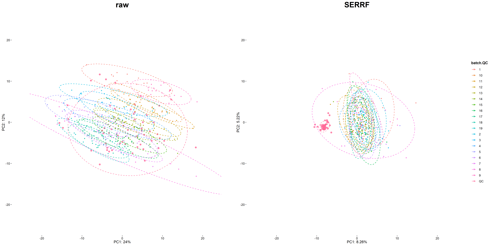
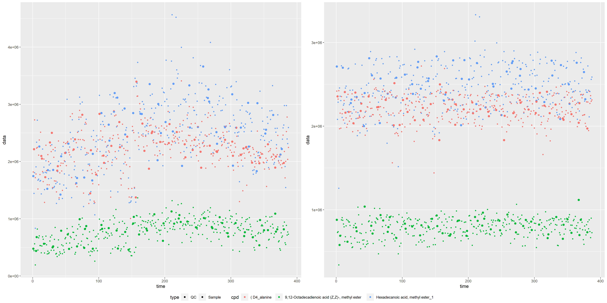

## data preparation

Place the attachments to the same folder and run the "Knit".


Now we run the script to analyze a GC-MS data set.

## Load data

```r
#data<-readData_serrf_native(path =  "GC-MS Result(PeakArea).csv",infopath="subject_information_sheet.csv")

data<-readData(path = "Area_7_20192281555.txt_output.csv")
```

```
## Data loading
```

```
## Data loaded
```
Loaded data has three components:
e, f, p

e contains the response data:

```r
data$e
```

```
## # A tibble: 198 x 387
##    X001.QC X002.PTB X003.Control X004.Control X005.PTB X006.Control X007.Control
##      <dbl>    <dbl>        <dbl>        <dbl>    <dbl>        <dbl>        <dbl>
##  1      0        0           0             0        0            0           0  
##  2   6061.    4777.         41.4        5934.    5177.        4944.         95.4
##  3   3980.    3771.       4420.         5389.    3896.        4350.       4824. 
##  4   5387.   10178.       8155.         7061.    7733.        8053.      10824. 
##  5   5962.    3709.       4646.         7852.    4591.        8808.       4796. 
##  6   6553.    5508.       5636.         5438.    3951.        7171.       7518. 
##  7   3026.    3162.       3475.         2912.    2667.        2940.       3370. 
##  8    872.     769.       1024.          803.     664.         836.       1210. 
##  9   6690.    5622.       7572.         4285.    4589.        4289.       5249. 
## 10   1250.    1504.       1732.          704.    1062.        1187.       1185. 
## # ... with 188 more rows, and 380 more variables: X008.QC <dbl>,
## #   X009.Control <dbl>, X010.Control <dbl>, X011.Control <dbl>, X012.PTB <dbl>,
## #   X013.Control <dbl>, X014.Control <dbl>, X015.Control <dbl>, X016.PTB <dbl>,
## #   X017.PTB <dbl>, X018.QC <dbl>, X020.QC <dbl>, X021.Control <dbl>,
## #   X022.Control <dbl>, X023.Control <dbl>, X024.Control <dbl>,
## #   X025.Control <dbl>, X026.Control <dbl>, X027.PTB <dbl>, X028.PTB <dbl>,
## #   X029.Control <dbl>, X030.QC <dbl>, X031.Control <dbl>, X032.Control <dbl>,
## #   X033.PTB <dbl>, X034.PTB <dbl>, X035.PTB <dbl>, X036.Control <dbl>,
## #   X037.PTB <dbl>, X038.Control <dbl>, X039.Control <dbl>, X040.QC <dbl>,
## #   X042.QC <dbl>, X043.Control <dbl>, X044.Control <dbl>, X045.Control <dbl>,
## #   X046.PTB <dbl>, X047.PTB <dbl>, X048.PTB <dbl>, X049.Control <dbl>,
## #   X050.Control <dbl>, X051.Control <dbl>, X052.QC <dbl>, X053.PTB <dbl>,
## #   X054.Control <dbl>, X055.Control <dbl>, X056.Control <dbl>,
## #   X057.Control <dbl>, X058.Control <dbl>, X059.PTB <dbl>, X060.Control <dbl>,
## #   X061.Control <dbl>, X062.QC <dbl>, X064.QC <dbl>, X065.PTB <dbl>,
## #   X066.Control <dbl>, X067.PTB <dbl>, X068.PTB <dbl>, X069.Control <dbl>,
## #   X070.Control <dbl>, X071.Control <dbl>, X072.PTB <dbl>, X073.Control <dbl>,
## #   X074.QC <dbl>, X075.Control <dbl>, X076.Control <dbl>, X077.PTB <dbl>,
## #   X078.Control <dbl>, X079.Control <dbl>, X080.Control <dbl>,
## #   X081.Control <dbl>, X082.PTB <dbl>, X083.Control <dbl>, X084.QC <dbl>,
## #   X086.QC <dbl>, X087.Control <dbl>, X088.Control <dbl>, X089.PTB <dbl>,
## #   X090.PTB <dbl>, X091.Control <dbl>, X092.Control <dbl>, X093.Control <dbl>,
## #   X094.PTB <dbl>, X095.PTB <dbl>, X096.QC <dbl>, X097.PTB <dbl>,
## #   X098.Control <dbl>, X099.Control <dbl>, X100.PTB <dbl>, X101.Control <dbl>,
## #   X102.Control <dbl>, X103.Control <dbl>, X104.Control <dbl>, X105.QC <dbl>,
## #   X107.Control <dbl>, X108.QC <dbl>, X109.PTB <dbl>, X110.PTB <dbl>,
## #   X111.Control <dbl>, X112.Control <dbl>, ...
```


f is the summary of all considered features:

```r
data$f
```

```
## # A tibble: 198 x 2
##    label                                            No
##    <chr>                                         <dbl>
##  1 Styrene                                           0
##  2 3-Picoline                                        1
##  3 Hexanoic acid, methyl ester                       2
##  4 Cyclotetrasiloxane, octamethyl-                   3
##  5 Butanoic acid, 3-hydroxy-, methyl ester, (S)-     4
##  6 Decane                                            5
##  7 Acetic acid, trichloro-, methyl ester             6
##  8 .alpha.-Methoxymethoxy-3-methoxymethoxybenzyl     7
##  9 Methyl 1-Dideuterio-2-propenyl Ether              8
## 10 1-isopropyl-2,3-dimethyl-aziridine                9
## # ... with 188 more rows
```
p is the summary of all samples, time is the injection order:

```r
data$p
```

```
## # A tibble: 387 x 4
##    label        batch sampleType  time
##    <chr>        <dbl> <chr>      <dbl>
##  1 X001.QC          1 QC             1
##  2 X002.PTB         1 Sample         2
##  3 X003.Control     1 Sample         3
##  4 X004.Control     1 Sample         4
##  5 X005.PTB         1 Sample         5
##  6 X006.Control     1 Sample         6
##  7 X007.Control     1 Sample         7
##  8 X008.QC          1 QC             8
##  9 X009.Control     1 Sample         9
## 10 X010.Control     1 Sample        10
## # ... with 377 more rows
```

So you may need to prepare your data into these format as well.

## Run Serrf

You can also embed plots, for example:


```r
SERRF_Norm_finaltable<-SERRF(data=data,Log_trans=F,zero_imputaion=T,vis_norm_result=F,Predict_level="QC")
```

## view the results
browser to the sub-folder to have a look at the normed results:

```r
library(magick)
```

```
## Warning: package 'magick' was built under R version 4.0.3
```

```
## Linking to ImageMagick 6.9.11.34
## Enabled features: cairo, freetype, fftw, ghostscript, lcms, pango, rsvg, webp
## Disabled features: fontconfig, x11
```

```r
p<-image_read(paste0("Area.csvSERRF_QC/combine_figure.png"))
p
```



Or the normed results of some representative features:

```r
library(magick)
p<-image_read(paste0("Area.csvSERRF_QC/combine_figure_pcs.png"))
print(p)
```

```
## # A tibble: 1 x 7
##   format width height colorspace matte filesize density
##   <chr>  <int>  <int> <chr>      <lgl>    <int> <chr>  
## 1 PNG     6000   3000 sRGB       FALSE   257755 118x118
```


